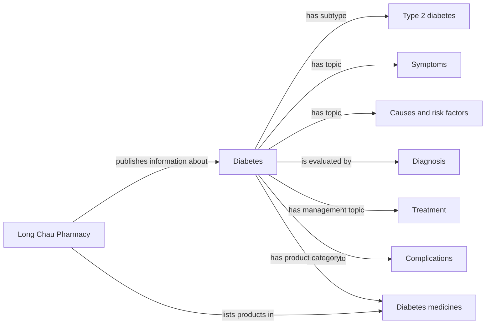

# Diabetes Knowledge Graph: Long Chau Sources

This is a starter knowledge graph for the diabetes application. It models concepts and relationships found in public Long Chau pages. It is intended for education and information retrieval, not diagnosis, prescribing, or treatment recommendation.

## Graph Structure



## Why This Is a Knowledge Graph

Each edge is a triple:

```text
(subject, relation, object)

(Diabetes, has subtype, Type 2 diabetes)
(Diabetes, is evaluated by, Diagnosis)
(Long Chau Pharmacy, publishes information about, Diabetes)
```

The machine-learning notebook represents a patient as numeric features. This graph represents medical concepts and their relationships. The two representations can support different tasks: prediction from patient measurements versus retrieval and explanation of diabetes information.

## Sources

- [Diabetes overview](https://nhathuoclongchau.com.vn/benh/benh-tieu-duong-289.html)
- [Type 2 diabetes](https://nhathuoclongchau.com.vn/benh/tieu-duong-tuyp-2.html)
- [Diabetes treatment](https://nhathuoclongchau.com.vn/bai-viet/huong-dan-cach-dieu-tri-benh-tieu-duong.html)
- [Diabetes complications](https://nhathuoclongchau.com.vn/bai-viet/nguyen-nhan-tieu-duong-va-cac-bien-chung-can-luu-y.html)
- [Diabetes medicine category](https://nhathuoclongchau.com.vn/thuoc/thuoc-tri-tieu-duong)

The machine-readable graph is stored in [diabetes_knowledge_graph.json](diabetes_knowledge_graph.json). Each relationship includes a source identifier and evidence note so the graph can be audited and expanded.
